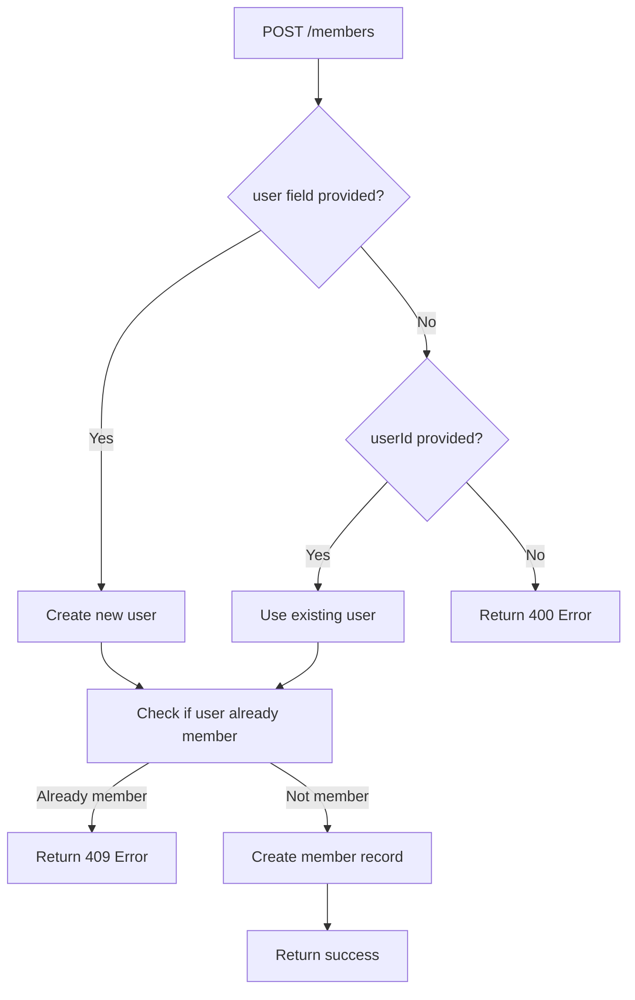

# Enhanced Member Creation API - Documentation

## 🎯 **Updated Create Member Endpoint**

The create member endpoint has been enhanced to support two workflows:
1. **Create new user and add as member** (recommended for new team members)
2. **Add existing user as member** (for users already in the system)

---

## 🚀 **Endpoint Details**

```
POST /members
Content-Type: application/json
Authorization: Bearer <token>
```

---

## 📝 **Updated Payload Examples**

### **Option 1: Create New User + Add to Multiple Teams (Recommended)**

Use this when adding a completely new person to multiple teams:

```json
{
  "user": {
    "name": "John",
    "firstname": "Doe", 
    "email": "john.doe@example.com",
    "password": "SecurePass123!"
  },
  "teams": [
    "68dfff1636ce6f72d45fb0bf",
    "68c5948004428e915dbbe7a2", 
    "68c595106d5c75c3fb5aedbe",
    "68c58cb10a90e579280e7b89"
  ],
  "role": "68f6d6cf08d49d57019e1162",
  "status": "active",
  "permissions": [
    "read",
    "write", 
    "delete",
    "manage"
  ],
  "notes": ""
}
```

### **Option 2: Add Existing User to Multiple Teams**

Use this when adding an existing user to multiple teams:

```json
{
  "userId": "507f1f77bcf86cd799439013",
  "teams": [
    "68dfff1636ce6f72d45fb0bf",
    "68c5948004428e915dbbe7a2"
  ],
  "role": "68f6d6cf08d49d57019e1162", 
  "status": "active",
  "permissions": ["view_projects"],
  "notes": "Transferred from marketing team"
}
```

---

## 🔧 **Field Specifications**

### **User Object (for new users):**
```typescript
{
  name: string;        // Required - Last name
  firstname: string;   // Required - First name  
  email: string;       // Required - Valid email (must be unique)
  password: string;    // Required - Minimum 8 characters
  phone?: string;      // Optional - Phone number
}
```

### **Core Member Fields:**
```typescript
{
  userId?: string;           // Optional - ObjectId of existing user
  user?: UserObject;         // Optional - New user information
  role: string;             // Required - ObjectId of role
  teams: string[];          // Required - Array of team ObjectIds
  status?: MemberStatus;    // Optional - Default: "active" 
  permissions?: string[];   // Optional - Additional permissions
  notes?: string;          // Optional - Admin notes
  joinedAt?: Date;         // Optional - Default: current date
}
```

### **Status Values:**
- `"active"` (default)
- `"inactive"`
- `"pending"`
- `"suspended"`

---

## 📋 **Complete Request Examples**

### **1. Frontend Developer (New User)**
```json
{
  "user": {
    "name": "Smith",
    "firstname": "Alice",
    "email": "alice.smith@company.com", 
    "password": "DevPass2024!"
  },
  "role": "64f1234567890abcdef12345", 
  "team": "64f1234567890abcdef12346",
  "status": "active",
  "permissions": [
    "access_frontend_repo",
    "deploy_staging", 
    "review_code"
  ],
  "notes": "Senior frontend developer, React specialist"
}
```

### **2. Project Manager (New User)**
```json
{
  "user": {
    "name": "Johnson", 
    "firstname": "Michael",
    "email": "m.johnson@company.com",
    "password": "PM_Secure123"
  },
  "role": "64f1234567890abcdef12347",
  "team": "64f1234567890abcdef12346", 
  "status": "active",
  "permissions": [
    "manage_team",
    "view_reports",
    "assign_tasks",
    "manage_milestones"
  ],
  "notes": "Experienced PM, leading mobile app project"
}
```

### **3. Contractor (New User, Pending Status)**
```json
{
  "user": {
    "name": "Brown",
    "firstname": "Sarah", 
    "email": "sarah.contractor@external.com",
    "password": "TempPass456!"
  },
  "role": "64f1234567890abcdef12348",
  "team": "64f1234567890abcdef12346",
  "status": "pending",
  "permissions": ["view_specific_project"],
  "notes": "3-month contractor for UI/UX design",
  "joinedAt": "2025-11-01T09:00:00.000Z"
}
```

### **4. Transfer Existing User**
```json
{
  "userId": "64f1234567890abcdef12349",
  "role": "64f1234567890abcdef12345",
  "team": "64f1234567890abcdef12350", 
  "status": "active",
  "permissions": ["maintain_legacy_code"],
  "notes": "Transferred from Team Alpha to support legacy systems"
}
```

---

## ✅ **Success Response**

The API now returns an array of created members (one for each team):

```json
[
  {
    "_id": "64f1234567890abcdef12351",
    "user": "64f1234567890abcdef12352", 
    "role": "68f6d6cf08d49d57019e1162",
    "team": "68dfff1636ce6f72d45fb0bf",
    "status": "active",
    "permissions": ["read", "write", "delete", "manage"],
    "joinedAt": "2025-10-22T10:00:00.000Z",
    "notes": "",
    "createdAt": "2025-10-22T10:00:00.000Z",
    "updatedAt": "2025-10-22T10:00:00.000Z"
  },
  {
    "_id": "64f1234567890abcdef12353",
    "user": "64f1234567890abcdef12352",
    "role": "68f6d6cf08d49d57019e1162", 
    "team": "68c5948004428e915dbbe7a2",
    "status": "active",
    "permissions": ["read", "write", "delete", "manage"],
    "joinedAt": "2025-10-22T10:00:00.000Z",
    "notes": "",
    "createdAt": "2025-10-22T10:00:00.000Z",
    "updatedAt": "2025-10-22T10:00:00.000Z"
  }
]
```

---

## ❌ **Error Responses**

### **Validation Error (400)**
```json
{
  "statusCode": 400,
  "message": [
    "email must be a valid email",
    "password must be longer than or equal to 8 characters"
  ],
  "error": "Bad Request"
}
```

### **User Already Exists (400)**
```json
{
  "statusCode": 400, 
  "message": "USER_ALREADY_EXISTS",
  "error": "Bad Request"
}
```

### **User Already Member (409)**
```json
{
  "statusCode": 409,
  "message": "User is already a member of this team",
  "error": "Conflict"
}
```

### **Missing User Info (400)**
```json
{
  "statusCode": 400,
  "message": "Either user information or userId must be provided", 
  "error": "Bad Request"
}
```

---

## 🔄 **Workflow Logic**



---

## 🎯 **Frontend Integration Example**

### **React Hook for Member Creation**
```typescript
const useCreateMember = () => {
  const [loading, setLoading] = useState(false);
  
  const createMemberWithUser = async (memberData: CreateMemberWithUserData) => {
    setLoading(true);
    try {
      const response = await fetch('/api/members', {
        method: 'POST',
        headers: {
          'Content-Type': 'application/json',
          'Authorization': `Bearer ${token}`
        },
        body: JSON.stringify(memberData)
      });
      
      if (!response.ok) {
        throw new Error('Failed to create member');
      }
      
      return await response.json();
    } finally {
      setLoading(false);
    }
  };

  return { createMemberWithUser, loading };
};
```

### **Usage Example**
```typescript
const { createMemberWithUser } = useCreateMember();

// Create new user + member
await createMemberWithUser({
  user: {
    name: "Doe",
    firstname: "Jane", 
    email: "jane.doe@company.com",
    password: "SecurePass123"
  },
  role: selectedRole.id,
  team: currentTeam.id,
  permissions: selectedPermissions,
  notes: formData.notes
});

// Add existing user as member
await createMemberWithUser({
  userId: existingUser.id,
  role: selectedRole.id, 
  team: currentTeam.id,
  permissions: selectedPermissions
});
```

---

## 🔒 **Security Considerations**

1. **Password Hashing**: Passwords are automatically hashed using bcrypt
2. **Email Uniqueness**: System prevents duplicate email addresses
3. **Team Membership**: Prevents adding same user to same team twice
4. **Permission Validation**: Ensure role and permissions are valid
5. **Input Sanitization**: All inputs are validated and sanitized

---

## 📊 **Best Practices**

### **When to Use Each Option:**

**Create New User + Member:**
- New employees joining the company
- External contractors/consultants  
- Clients getting team access
- Anyone not yet in the system

**Add Existing User:**
- Internal team transfers
- Promoting users to new teams
- Cross-functional collaboration
- Temporary team assignments

### **Required ObjectIds:**
- `role`: Must be valid Role document ID
- `team`: Must be valid Team document ID  
- `userId`: Must be valid User document ID (when using existing user)

### **Permission Management:**
- Base permissions come from the assigned role
- Additional permissions can be added via `permissions` array
- Permissions are strings that your application defines

This enhanced API provides maximum flexibility for team management while maintaining data integrity and security! 🚀