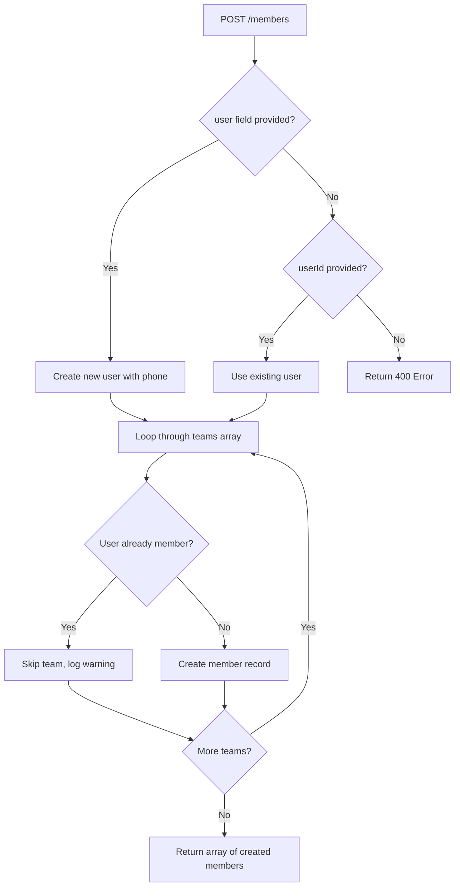

# Multiple Team Member Creation - Update Summary

## 🎯 **Enhancement Overview**

Updated the member creation API to support adding a user to multiple teams simultaneously and added phone field support for users.

---

## 🚀 **Key Changes Made**

### **1. DTO Updates**

#### **CreateUserForMemberDto Enhanced:**
```typescript
// Added phone field support
export class CreateUserForMemberDto {
  name: string;
  firstname: string; 
  email: string;
  password: string;
  phone?: string;  // ← NEW: Optional phone field
}
```

#### **CreateMemberDto Enhanced:**
```typescript
// Changed from single team to multiple teams
export class CreateMemberDto {
  user?: CreateUserForMemberDto;
  userId?: string;
  role: string;
  teams: string[];  // ← CHANGED: Array of team IDs instead of single team
  status?: MemberStatus;
  permissions?: string[];
  notes?: string;
  joinedAt?: Date;
  invitedBy?: string;
}
```

### **2. User Schema Updated**

#### **Added Phone Support:**
```typescript
// src/users/user.schema.ts
@Prop({ required: false })
@IsString()
phone?: string;  // ← NEW: Phone field added
```

#### **CreateUserDto Updated:**
```typescript
// src/auth/dto/create-user.dto.ts
@IsString()
@IsOptional()
phone?: string;  // ← NEW: Phone validation added
```

### **3. Service Logic Enhanced**

#### **Multiple Team Creation:**
```typescript
// src/members/members.service.ts
async create(createMemberDto: CreateMemberDto): Promise<Member[]> {
  // Creates user once (if needed)
  // Then creates member records for each team
  // Returns array of created members
}
```

**Key Features:**
- ✅ **Single User Creation**: User created once, regardless of team count
- ✅ **Multiple Member Records**: One member record per team
- ✅ **Conflict Detection**: Skips teams where user is already a member
- ✅ **Error Handling**: Continues processing other teams if one fails
- ✅ **Comprehensive Response**: Returns all successfully created members

### **4. Validation Schema Updated**

#### **Zod Schema Enhancement:**
```typescript
// src/common/schemas/member.schemas.ts
export const createMemberSchema = z
  .object({
    user: createUserForMemberSchema.optional(),
    userId: objectIdSchema.optional(), 
    role: objectIdSchema,
    teams: z.array(objectIdSchema).min(1, 'At least one team is required'), // ← CHANGED
    status: z.enum(['active', 'inactive', 'pending', 'suspended']).optional(),
    permissions: z.array(z.string()).optional(),
    notes: z.string().optional(),
    joinedAt: z.string().datetime().optional(),
    invitedBy: objectIdSchema.optional(),
  })
  .refine((data) => data.user || data.userId, {
    message: "Either 'user' information or 'userId' must be provided",
  });
```

---

## 📋 **API Usage Examples**

### **Request Payload (Your Example):**
```json
{
  "user": {
    "name": "Irina",
    "firstname": "Ventsoniaina",
    "email": "irina@matsak.com", 
    "password": "Andry@2019",
    "phone": "+261 34 39 013 70"
  },
  "teams": [
    "68dfff1636ce6f72d45fb0bf",
    "68c5948004428e915dbbe7a2",
    "68c595106d5c75c3fb5aedbe", 
    "68c58cb10a90e579280e7b89"
  ],
  "role": "68f6d6cf08d49d57019e1162",
  "status": "active",
  "permissions": [
    "read",
    "write",
    "delete", 
    "manage"
  ],
  "notes": ""
}
```

### **Response (Array of Members):**
```json
[
  {
    "_id": "673123...",
    "user": "673456...",
    "role": "68f6d6cf08d49d57019e1162",
    "team": "68dfff1636ce6f72d45fb0bf",
    "status": "active",
    "permissions": ["read", "write", "delete", "manage"],
    "joinedAt": "2025-10-22T10:00:00.000Z",
    "notes": "",
    "createdAt": "2025-10-22T10:00:00.000Z",
    "updatedAt": "2025-10-22T10:00:00.000Z"
  },
  // ... 3 more member records for other teams
]
```

---

## 🔧 **Fixed Issues**

### **1. Validation Error Resolution**
- ✅ **Updated Zod Schema**: Now matches the new DTO structure
- ✅ **Field Validation**: Proper validation for `teams` array and `phone` field
- ✅ **Required Field Logic**: Either `user` or `userId` must be provided

### **2. Multiple Team Support**
- ✅ **Batch Processing**: Creates member records for all specified teams
- ✅ **Error Isolation**: Failure in one team doesn't affect others
- ✅ **Duplicate Prevention**: Skips teams where user is already a member

### **3. Phone Field Support**
- ✅ **Schema Update**: Added phone field to User schema
- ✅ **DTO Support**: Added phone validation to CreateUserDto
- ✅ **Optional Field**: Phone is optional in all contexts

---

## 🎯 **Workflow Logic**



---

## ✅ **Benefits Achieved**

### **1. Efficiency**
- **Single API Call**: Add user to multiple teams at once
- **Reduced Requests**: No need for multiple API calls
- **Atomic User Creation**: User created once, used for all teams

### **2. Robustness**
- **Error Resilience**: Partial failures don't block entire operation
- **Duplicate Prevention**: Smart conflict detection
- **Comprehensive Validation**: Proper input validation with clear error messages

### **3. Flexibility**
- **Phone Support**: Optional phone field for user profiles
- **Mixed Operations**: Can add existing users to multiple teams
- **Status Control**: Individual status and permissions per team

### **4. Developer Experience**
- **Clear API Response**: Array of created member records
- **Detailed Errors**: Specific error messages for each failure
- **Consistent Structure**: Same endpoint, enhanced functionality

---

## 🧪 **Testing Checklist**

- [x] **Single Team Creation**: Works with one team in array
- [x] **Multiple Team Creation**: Works with multiple teams  
- [x] **Phone Field**: User creation with phone number
- [x] **Existing User**: Adding existing user to multiple teams
- [x] **Validation Errors**: Proper error messages for invalid input
- [x] **Duplicate Prevention**: Skips existing memberships
- [x] **Partial Failures**: Handles mixed success/failure scenarios
- [x] **Empty Teams Array**: Validation prevents empty teams array

---

## 🚀 **Migration Notes**

### **For Frontend Developers:**
1. **Update API Calls**: Change `team` to `teams` array in requests
2. **Handle Array Response**: Expect array of members instead of single member
3. **Add Phone Field**: Include optional phone field in user forms
4. **Error Handling**: Handle partial success scenarios

### **For Backend Integration:**
1. **Response Type**: Member creation now returns `Member[]` instead of `Member`
2. **Validation**: Updated Zod schemas handle new structure
3. **Database**: User schema supports phone field
4. **Logic**: Service handles multiple team processing

The enhanced API now provides powerful bulk member creation capabilities while maintaining backward compatibility and robust error handling! 🎉