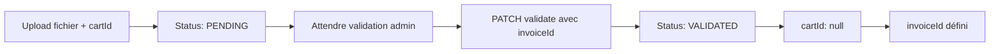

# Collection Prescription Documentation

## Overview
La collection **Prescription** permet de gérer les fichiers prescription (PDF ou images) avec un statut de validation et des références au panier et à la facture.

## Schéma

```typescript
export enum PrescriptionStatus {
  PENDING  = 'pending',    // En attente de validation
  VALIDATED = 'validated', // Validée et liée à une facture
  REFUSED  = 'refused',    // Refusée par l'admin
}

export class Prescription {
  // Métadonnées du fichier
  fileName: string;          // Nom original du fichier (affiché à l'utilisateur)
  storagePath: string;       // Chemin de stockage local (relatif à la racine)
  fileUrl: string;           // URL publique d'accès au fichier
  mimeType: string;          // Type MIME (PDF ou image)
  size: number;              // Taille en octets

  // Références
  cartId?: Types.ObjectId;    // ID du panier (supprimé lors de la validation)
  invoiceId?: Types.ObjectId; // ID de la facture (défini lors de la validation)

  // Statut
  status: PrescriptionStatus; // PENDING, VALIDATED ou REFUSED
  validatedAt?: Date;         // Date de validation

  // Audit
  validatedBy?: string;       // ID de l'admin ayant validé
  rejectionReason?: string;   // Motif de refus

  // Soft delete
  deleted_at?: Date;          // Marquage suppression logique (fichier disque supprimé)

  // Timestamps MongoDB
  createdAt: Date;
  updatedAt: Date;
}
```

## Politique de suppression

| Action | DB | Fichier disque |
|---|---|---|
| `DELETE /prescription/:id` | Suppression physique | ✅ Supprimé via `fs.unlinkSync` |
| Soft delete (futur) | `deleted_at` défini | ⚠️ Fichier conservé pour audit |

> **Note** : La suppression via l'API (`DELETE`) supprime à la fois le document en base
> et le fichier physique sur le disque. Si une traçabilité complète est requise,
> privilégier un soft delete sans suppression du fichier.

## Fichiers autorisés
- **PDF** : `application/pdf`
- **Images** : `image/jpeg`, `image/png`, `image/webp`
- **Taille max** : 10 MB
- **Stockage** : `uploads/prescriptions/<uuid>.<ext>`

## API Endpoints

### 1. Créer une prescription
```http
POST /api/prescription
Content-Type: multipart/form-data

file:   <binary>
cartId: <mongoId> (optionnel, doit être un ObjectId valide)
```

**Réponse (201)** :
```json
{
  "_id": "507f1f77bcf86cd799439011",
  "fileName": "ordonnance.pdf",
  "storagePath": "uploads/prescriptions/a1b2c3-uuid.pdf",
  "fileUrl": "https://monapp.com/uploads/prescriptions/a1b2c3-uuid.pdf",
  "mimeType": "application/pdf",
  "size": 245678,
  "cartId": "507f1f77bcf86cd799439012",
  "invoiceId": null,
  "status": "pending",
  "validatedAt": null,
  "createdAt": "2025-04-09T12:00:00Z",
  "updatedAt": "2025-04-09T12:00:00Z"
}
```

**Erreurs** :
- `400` : `ONLY_PDF_AND_IMAGE_FILES_ARE_ALLOWED`
- `400` : `FILE_IS_REQUIRED`
- `400` : `INVALID_CART_ID`

---

### 2. Lister toutes les prescriptions
```http
GET /api/prescription
```

**Réponse (200)** : Array of prescriptions

---

### 3. Récupérer une prescription
```http
GET /api/prescription/:id
```

**Erreurs** :
- `404` : Prescription not found

---

### 4. Lire le fichier physique
```http
GET /api/prescription/:id/file
```

**Réponse** : Fichier streamé inline (PDF affiché dans le navigateur, image affichée)

**Erreurs** :
- `400` : `INVALID_FILE_PATH`
- `400` : `FILE_NOT_FOUND`
- `404` : Prescription not found

---

### 5. Valider une prescription
```http
PATCH /api/prescription/:id/validate
Content-Type: application/json

{
  "invoiceId": "507f1f77bcf86cd799439015"
}
```

**Effet** :
- ✅ Status devient `VALIDATED`
- ✅ `cartId` devient `null`
- ✅ `validatedAt` est défini à la date actuelle
- ✅ `invoiceId` est assigné

**Réponse (200)** :
```json
{
  "_id": "507f1f77bcf86cd799439011",
  "fileName": "ordonnance.pdf",
  "storagePath": "uploads/prescriptions/a1b2c3-uuid.pdf",
  "fileUrl": "https://monapp.com/uploads/prescriptions/a1b2c3-uuid.pdf",
  "mimeType": "application/pdf",
  "size": 245678,
  "cartId": null,
  "invoiceId": "507f1f77bcf86cd799439015",
  "status": "validated",
  "validatedAt": "2025-04-09T12:05:00Z",
  "createdAt": "2025-04-09T12:00:00Z",
  "updatedAt": "2025-04-09T12:05:00Z"
}
```

**Erreurs** :
- `400` : invoiceId is required to validate prescription
- `404` : Prescription not found

---

### 6. Supprimer une prescription
```http
DELETE /api/prescription/:id
```

**Effet** :
- ✅ Document supprimé de la base de données
- ✅ Fichier physique supprimé du disque

**Erreurs** :
- `404` : Prescription not found

---

## Flux de travail

### Cas 1 : Création avec cartId


### Cas 2 : Création sans cartId