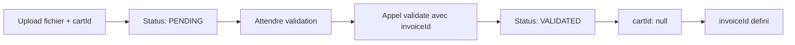

# Collection Prescription Documentation

## Overview
La collection **Prescription** permet de gérer les fichiers prescription (PDF ou images) avec un statut de validation et des références aux panier et facture.

## Schéma

```typescript
export enum PrescriptionStatus {
  PENDING = 'pending',    // En attente de validation
  VALIDATED = 'validated' // Validée et liée à une facture
}

export class Prescription {
  // Métadonnées du fichier 
  originalName: string;      // Nom original du fichier
  storagePath: string;       // Chemin de stockage local
  mimeType: string;          // Type MIME (PDF ou image)
  size: number;              // Taille en octets
  
  // Références 
  cartId?: Types.ObjectId;   // ID du panier (supprimé lors de la validation)
  invoiceId?: Types.ObjectId; // ID de la facture (défini lors de la validation)
  
  // Statut
  status: PrescriptionStatus; // PENDING ou VALIDATED
  validatedAt?: Date;         // Date de validation
  
  // Soft delete
  deleted_at?: Date;
  
  // Timestamps MongoDB
  createdAt: Date;
  updatedAt: Date;
}
```

## Fichiers autorisés
- **PDF** : `application/pdf`
- **Images** : `image/jpeg`, `image/png`, `image/webp`
- **Taille max** : 10MB

## API Endpoints

### 1. Créer une prescription
```http
POST /prescription
Content-Type: multipart/form-data

file: <binary>
cartId: <mongoId> (optionnel)
```

**Réponse (201)** :
```json
{
  "_id": "507f1f77bcf86cd799439011",
  "originalName": "ordonnance.pdf",
  "storagePath": "./uploads/prescriptions/1695312000000-ordonnance.pdf",
  "mimeType": "application/pdf",
  "size": 245678,
  "cartId": "507f1f77bcf86cd799439012",
  "invoiceId": null,
  "status": "pending",
  "validatedAt": null,
  "createdAt": "2025-04-09T12:00:00Z",
  "updatedAt": "2025-04-09T12:00:00Z"
}
```

**Erreurs** :
- `400` : Seuls les fichiers PDF ou images sont autorisés
- `400` : Le fichier prescription est requis

---

### 2. Lister toutes les prescriptions
```http
GET /prescription
```

**Réponse (200)** : Array of prescriptions

---

### 3. Récupérer une prescription
```http
GET /prescription/:id
```

**Erreurs** :
- `404` : Prescription not found

---

### 4. Valider une prescription
```http
PATCH /prescription/:id/validate
Content-Type: application/json

{
  "invoiceId": "507f1f77bcf86cd799439015"
}
```

**Effet** :
- ✅ Status devient `VALIDATED`
- ✅ `cartId` devient `null`
- ✅ `validatedAt` est défini à la date actuelle
- ✅ `invoiceId` est assigné

**Réponse (200)** :
```json
{
  "_id": "507f1f77bcf86cd799439011",
  "originalName": "ordonnance.pdf",
  "storagePath": "./uploads/prescriptions/1695312000000-ordonnance.pdf",
  "mimeType": "application/pdf",
  "size": 245678,
  "cartId": null,
  "invoiceId": "507f1f77bcf86cd799439015",
  "status": "validated",
  "validatedAt": "2025-04-09T12:05:00Z",
  "createdAt": "2025-04-09T12:00:00Z",
  "updatedAt": "2025-04-09T12:05:00Z"
}
```

**Erreurs** :
- `400` : invoiceId is required to validate prescription
- `404` : Prescription not found

---

## Flux de travail

### Cas 1 : Création avec cartId


### Cas 2 : Création sans cartId
```
POST /prescription {file}
→ Status: PENDING
→ Pas de cartId
→ Attendre validation
→ PATCH /prescription/:id/validate {invoiceId}
```

---

## Validation
- **Pre-hook Mongoose** : Lorsque `status === VALIDATED`, `invoiceId` **doit** être défini
- **On validation** : `cartId` est automatiquement supprimé (`null`)
- **Soft delete** : Les prescriptions ne sont jamais supprimées, seulement marquées avec `deleted_at`

---

## Indices MongoDB
- Index sur `cartId` (sparse, optimise les recherches)
- Index sur `invoiceId` (sparse, optimise les recherches)
- Index sur `status` (facilite les filtres PENDING/VALIDATED)
- Filtrage automatique des `deleted_at` via BaseRepository

---

## Intégration avec les modules existants

### Cart (panier)
- Référence optionnelle : `cartId` au moment de l'upload
- Supprimée lors de la validation

### Invoice (facture)
- Référence assignée lors de `validate()`
- Lie la prescription validée à la facture émise

### Base Repository
- Utilise `BaseRepository<Prescription>`
- Soft deletes automatiques
- Gestion des ObjectIds

---

## Exemple complet

```typescript
// 1. Upload
const prescription = await prescriptionService.create({
  originalName: 'ordonnance.pdf',
  storagePath: './uploads/prescriptions/1234-ordonnance.pdf',
  mimeType: 'application/pdf',
  size: 245678,
  cartId: 'cart_id_here',
  status: PrescriptionStatus.PENDING
});
// → _id créé, status = PENDING, cartId stocké

// 2. Validation (après émission de la facture)
const validated = await prescriptionService.validate(
  prescription._id,
  'invoice_id_here'
);
// → status = VALIDATED
// → invoiceId assigné
// → cartId = null
// → validatedAt = maintenant
```

---

## Notes de sécurité
- ✅ Filtrage des types MIME (PDF, images uniquement)
- ✅ Limite de 10MB par fichier
- ✅ Stockage disque local (`./uploads/prescriptions/`)
- ✅ Validation pre-hook Mongoose pour intégrité
- ✅ Soft deletes pour traçabilité

